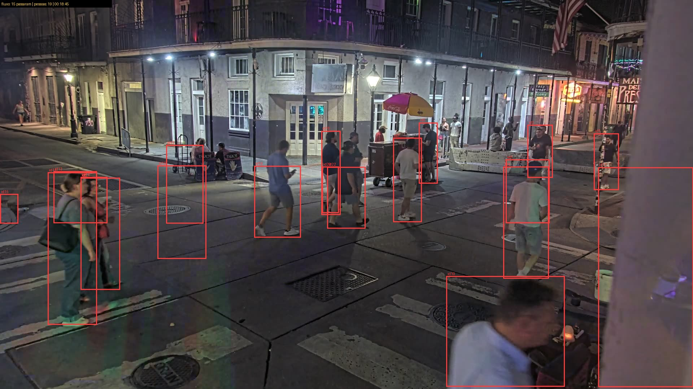
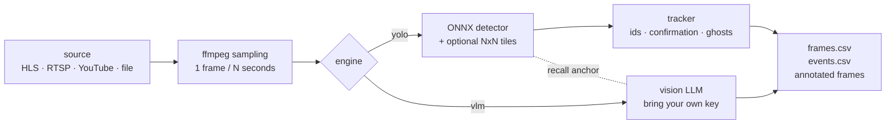

<div align="center">

# streamcount

**Count people and vehicles in any live stream or recording.**
Paste a link — YouTube live, YouTube video, HLS, RTSP, or a local file — get per-frame counts
and unique passers-by, with a local ONNX detector (free, offline) or a vision LLM (your own API key).

[](https://github.com/Eddienews/streamcount/actions/workflows/ci.yml)
[](LICENSE)
[](https://www.python.org/)



</div>

---

## Why it exists

Every "people counter" repo assumes you own the camera and a GPU, or that you will pay a
cloud service per stream. streamcount starts from the opposite end:

- **Any source**: an HLS (.m3u8) link, an RTSP camera, a YouTube live stream *or* a YouTube
  recording, a local video, or a folder of frames.
- **Two engines, one CLI**:
  - `--engine yolo` — local ONNX detector. **Zero API cost**, runs offline. CPU-only is fine.
  - `--engine vlm` — any vision LLM behind an OpenAI-compatible endpoint (OpenRouter by
    default, bring your own key). Better on distant/occluded people, costs per frame.
  - `--engine both` — the same frame through both, side by side, for calibration.
- **"How many are there now" *and* "how many passed"**: per-frame counts plus a tracker that
  assigns ids and counts each person once — people who just stand around never count as
  passers-by ([flow mode](#flow-mode--who-passed-not-how-many-are-on-screen)).

## Install

```bash
# from source (recommended while pre-PyPI)
git clone https://github.com/Eddienews/streamcount
cd streamcount && python -m venv .venv && . .venv/bin/activate   # Windows: .venv\Scripts\activate
pip install -e ".[dev]"

# or with Docker (ffmpeg included)
docker compose run --rm streamcount run --youtube "https://www.youtube.com/watch?v=..." --frames 5
```

Requirements: Python 3.10+, `ffmpeg` on PATH. YouTube links additionally need
`yt-dlp` (and, only when YouTube demands it, a JS runtime: `--yt-js-runtime node:/path/to/node`).

The default model (YOLOv8n-pose ONNX, 13 MB) downloads automatically on first run into
`~/.cache/streamcount`. Pre-download with `streamcount download-model`.

## Quickstart

```bash
# A public night-street webcam, local detector, 30 frames every 2 s, annotated output
streamcount run --url "https://videos-3.earthcam.com/fecnetwork/4280.flv/playlist.m3u8?t=..." \
    --headers "Referer=https://www.earthcam.com/" \
    --engine yolo --tiles 2 --interval 2 --frames 30 --annotate

# YouTube live stream, vision LLM, one frame every 5 s
export OPENROUTER_API_KEY=sk-or-...
streamcount run --youtube "https://www.youtube.com/watch?v=LIVE_ID" \
    --engine vlm --interval 5 --frames 120

# A recording: sample from 2 min in, 60 frames
streamcount run --video my_recording.mp4 --seek 120 --engine both --frames 60

# Count who PASSES (unique ids) for 1 hour, with a VLM recall check every 60 s
streamcount run --url "$STREAM" --engine yolo --tiles 2 --interval 2 --frames 1800 \
    --flow --vlm-check 60 --annotate

# Webcam pages hide expiring tokens: extract a fresh stream URL
streamcount find-stream "https://www.earthcam.com/usa/louisiana/neworleans/bourbonstreet/" --cam-id 4280
```

Outputs (one folder per run):

| file | content |
|---|---|
| `frames.csv` | one row per sampled frame per engine: count, latency, active tracks, passes total |
| `events.csv` | flow mode: one row per person counted (`t`, `id`, `hits`, `displacement`, running total) |
| `frames/*.jpg` | annotated frames (`--annotate`): boxes, track ids, running total |
| `summary.json` | machine-readable summary, including recall correction when `--vlm-check` is used |

## Flow mode — "who passed", not "how many are on screen"

A per-frame count answers *"how many people are visible right now"*. It cannot answer
*"how many people passed during the last hour"* — the same person appears in dozens of
frames. Flow mode tracks:

1. detections are associated into tracks (IoU or centre distance — sampling gaps of 1-5 s
   make IoU alone too strict);
2. a track is **confirmed** after `--flow-min-hits` detections (default 3, filters noise);
3. it is **counted once** when it has moved `--flow-min-move` px (default 40) from where it
   first appeared — standing people (vendors, buskers) are never counted as passers-by;
4. dead tracks become ghosts for 15 s, so a detection drop-out does not spawn a second count.



## Accuracy: what this does and does not deliver

Measured on a real 1080p night street camera (see [docs/MEASUREMENTS.md](docs/MEASUREMENTS.md)):

- The nano detector on the **full frame** found 3 of ~12 people in the scene. With
  **`--tiles 2`** it found 9-10 of ~12 (one duplicate pair), at ~0.8-1.2 s/frame on CPU.
- The **VLM** counted 12 / 13 / 12 on three runs of the *same* frame (temperature 0) —
  treat its number as ±1-2, not a census. In a dense crowd it over-counts (~30-34 vs a
  manual ~25-30).
- In flow mode, the detector's **recall was ~46%** on that night scene (8.0 visible detected
  vs 17.5 seen by the VLM). Raw tracker passes are therefore a **floor**; `--vlm-check`
  measures the recall and reports a corrected estimate (28 → ~61 passes over 80 s of video).
- False positives do happen (a table with a candle was once "a person") — validate visually
  before trusting a threshold-critical number.

**Use it for trend, throughput and relative comparison. Do not use it as a legally exact
census.** The tool reports latency, recall and uncertainty on purpose — most counting demos do not.

## Cost of the AI (vision LLM engine)

Measured on `google/gemini-2.5-flash-lite` via OpenRouter, 1080p frame: **1,887 input +
~33 output tokens per frame ≈ $0.0002/frame**.

| Sampling | Frames/hour | Cost/hour |
|---|---|---|
| every 2 s | 1,800 | ~$0.36 |
| every 5 s | 720 | ~$0.15 |
| every 30 s | 120 | ~$0.02 |
| local detector only | — | **$0.00** (your CPU) |

Reducing the frame resolution did **not** reduce token cost in our measurements (same 1,887
tokens at 1280 px and 640 px) — the sampling rate is the real cost lever. Recordings can use
batch endpoints (~50 % cheaper). Full table and provider comparison (qwen, gemma):
[docs/COSTS.md](docs/COSTS.md).

## Sources

| Source | How | Notes |
|---|---|---|
| HLS / .m3u8 | `--url` | webcams often need `--headers "Referer=..."`; tokens expire → `find-stream` |
| RTSP | `--url rtsp://...` | works through the same ffmpeg pipe |
| YouTube live | `--youtube URL` | yt-dlp; may need `--yt-js-runtime node:...` |
| YouTube recording | `--youtube URL` | sample with `--interval`/`--seek` |
| Local video | `--video file.mp4` | |
| Images | `--image f.jpg` / `--images DIR` | a folder is treated as a frame sequence |

## Limitations & ethics

- **No identification.** This counts people; it does not recognize faces, and it should not
  be extended to do so. Aggregate counting in public spaces is one thing, biometric
  surveillance is another (and illegal without a proper legal basis in many jurisdictions).
- Respect the terms of the streams you process; do not redistribute third-party streams, and
  keep polling rates sane (≥ 1 s).
- The VLM engine sends sampled frames (JPEG, ~1280 px, no audio) to the provider you
  configure. The local detector sends nothing anywhere.
- Bundled model weights are **not** included in this repository. streamcount downloads
  Ultralytics YOLOv8-pose ONNX exports on first use; those weights are **AGPL-3.0** licensed
  by their authors. For commercial use, either comply with AGPL or point `--model` at weights
  you are licensed to use. See `LICENSE` and `NOTICE.md`.

## Roadmap

- [ ] COCO detection model variant + validated vehicle counting (`--target cars`)
- [ ] Zones / line-crossing counts (in/out direction)
- [ ] Web UI (paste link → live dashboard)
- [ ] Re-ID across longer occlusions
- [ ] PyPI release + one-file binaries

## Contributing

Issues and PRs welcome — see [CONTRIBUTING.md](CONTRIBUTING.md). The tracker has an offline
test suite (`pytest`, 17 tests) so you can hack on it without a camera or a key.

## License

MIT — see [LICENSE](LICENSE). Third-party model weights are **not** MIT; see the note above.
